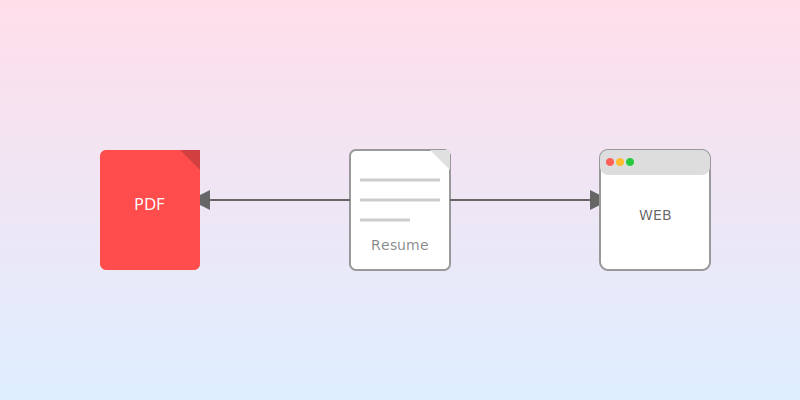

<center>
<h1>ResumeFlow</h1>



</center>

ResumeFlow는 단일 데이터 소스에서 웹과 PDF 형식의 이력서를 동시에 관리하고 생성할 수 있는 멀티포맷 이력서 생성 시스템입니다.

### 🔍 문제 인식 및 필요성

이력서는 계속 변하므로 업데이트 및 변형본을 만드는게 쉬워야 합니다. 또한 PDF 출력이 가능해야 합니다.

- **이력서는 계속 변함**: 이력서는 단 한 번 작성하고 끝나는 문서가 아닙니다. 새로운 경험, 기술, 자격증이 추가될 때마다 계속 업데이트되어야 합니다.
- **다양한 버전으로 재생성하기 쉬어야 함**: 다양한 직무나 회사에 맞춰 여러 버전의 이력서를 만들어야 할 필요성이 종종 있습니다.
- **PDF 출력** : 대부분 회사에서 PDF형식의 이력서를 요구합니다. 그런데 웹버전을 기반으로 만들어진 이력서는 페이지 경계에서 부자연스럽게 나뉘거나 섹션 배치를 마음대로 할 수 없어서 가독성을 해치는 경우가 많았습니다.

### 📝 사용 방법

1. **데이터 입력**: `수정` 페이지에서 이력서 정보를 입력합니다.
2. **레이아웃 조정**: 섹션 순서와 스타일을 조정합니다.
3. **미리보기**: 변경 사항이 실시간으로 PDF에 반영되는 것을 확인합니다.
4. **내보내기**: 완성된 이력서를 PDF파일로 저장합니다.

<br/>
<br/>

<center>
<h2>Development</h2>
</center>

### 🔰 Getting Started

```bash
# 저장소 클론
git clone https://github.com/yourusername/resumeflow.git
cd resumeflow

# 의존성 설치
npm install

# 개발 서버 실행
npm run dev
```

### 🚀 Project Structure

```
src/
├── app/ # Next.js App Router
│ ├── preview/ # PDF 미리보기 페이지
│ ├── edit/ # 이력서 수정 페이지
│ └── ...
├── components/ # 공통 컴포넌트
│ ├── ui/ # 기본 UI 컴포넌트
│ ├── forms/ # 입력 폼 관련 컴포넌트
│ └── pdf/ # PDF 관련 컴포넌트
│ ├── renderers/ # 다양한 유형의 렌더러
│ └── ...
├── lib/ # 유틸리티 및 핵심 로직
└── data/ # 샘플/목 데이터
```

### 💡 설계 의도

이 프로젝트는 빠르게 프로토타입을 만들고, 이후의 확장성과 유지보수성을 높이는 것을 목표로 설계되었습니다. 새로운 렌더러를 추가하거나 기존 렌더러를 수정하는 것이 용이하며, 타입 시스템을 통해 데이터 일관성을 보장합니다. 최소한의 기능으로 구현되었지만 추후에 새로운 기능을 추가하는 것이 용이하도록 하였습니다.

1. **단일 데이터 소스**: 모든 이력서 콘텐츠는 한 곳에서 관리되어 일관성을 유지합니다.
2. **관심사 분리**: 데이터, 레이아웃, 렌더링 로직을 분리하여 유지보수성을 높였습니다.
3. **확장 가능한 렌더러 시스템**: 새로운 컴포넌트 유형을 쉽게 추가할 수 있는 플러그인 방식의 렌더러 시스템을 구현했습니다.
4. **PDF 최적화**: 페이지 경계를 고려한 레이아웃 배치로 전문적인 결과물을 보장합니다.

[이곳](agenda.md)에서 주요 Agenda를 확인할 수 있습니다.

### 🤝 기여하기

이 프로젝트에 기여하고 싶으시다면:

1. 이 저장소를 포크하세요
2. 새로운 기능 브랜치를 만드세요 (git checkout -b feature/amazing-feature)
3. 변경 사항을 커밋하세요 (git commit -m 'Add some amazing feature')
4. 브랜치에 푸시하세요 (git push origin feature/amazing-feature)
5. Pull Request를 제출하세요

또는 Issue를 통해 기여하고 싶은 내용을 간단히 제안/리포트해주세요.
